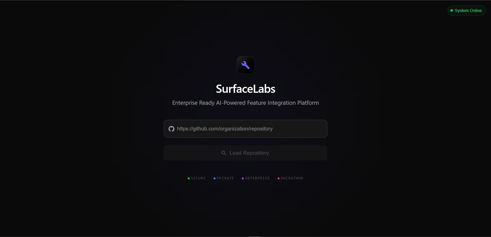
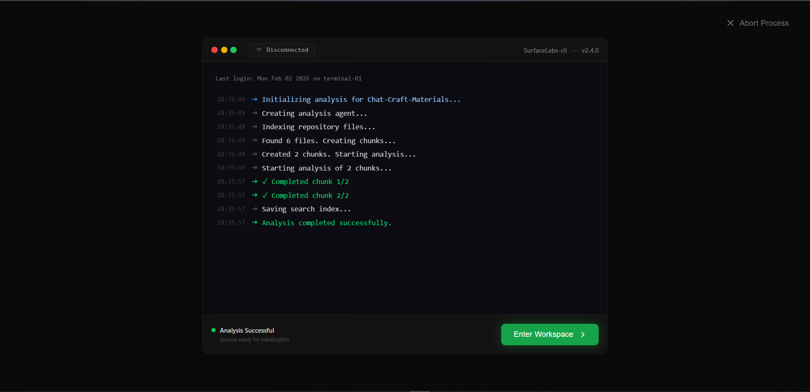
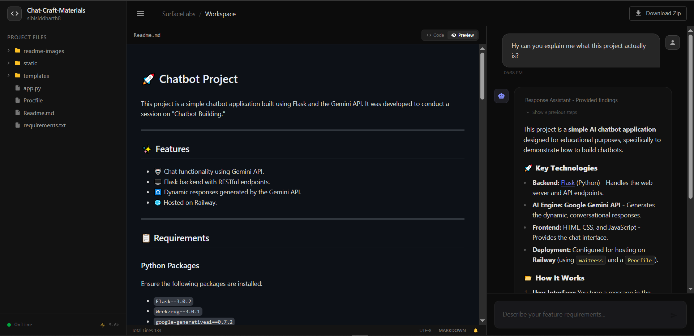

# SurfaceLabs

SurfaceLabs is an AI-powered assistant that helps developers add **specific features** to existing codebases — without rebuilding the whole application.

Instead of asking an AI to "generate an entire app", SurfaceLabs focuses on **incremental development**: it understands your project, then guides you with code changes that fit naturally into it.

<p align="center">
  
</p>

---

## 🚀 What problem does it solve?

Most AI tools struggle with real-world codebases:

- They don't fully understand project structure
- They overwrite files instead of modifying them safely
- They generate code that doesn't match the project style
- Developers waste time integrating and fixing AI output

SurfaceLabs is built to work **inside existing projects**, not replace them.

---

## ✨ What SurfaceLabs does

- 🔎 Analyzes your repository (GitHub or local project)
- 🧠 Understands architecture, dependencies, and patterns
- 📝 Accepts natural-language feature requests (e.g., _"Add JWT authentication and protect the dashboard API"_)
- 🛠 Generates **targeted diffs and code suggestions**
- 📌 Explains where changes go — and why
- ⚠ Avoids overwriting working code

<p align="center">
  
</p>

---

## 🎯 Why it's useful

SurfaceLabs helps you:

- build faster without rewriting everything
- safely introduce new features
- reduce bugs caused by copy-paste AI code
- learn best practices from structured explanations
- integrate AI output confidently

---

## 🌟 The vision

SurfaceLabs bridges the gap between:

> **"AI generated some code"**  
> and  
> **"this integrates cleanly into my real project."**

By focusing on _feature-level intelligence_, it supports modern, iterative development instead of one-shot code generation.

<p align="center">
  
</p>

---

## 🛠️ Getting Started

### Prerequisites

Before starting, ensure you have an API key from [Google AI Studio](https://aistudio.google.com/).

### Backend Setup

1.  Navigate to the `Backend` directory:
    ```bash
    cd Backend
    ```
2.  Install dependencies:
    ```bash
    pip install -r requirements.txt
    ```
3.  Configure environment variables. Create or edit the `.env` file and add your API key:
    ```bash
    export GOOGLE_API_KEY=YOUR_API_KEY_HERE
    ```
4.  Launch the backend server:
    ```bash
    python run.py
    ```

### Frontend Setup

1.  Navigate to the `Frontend` directory:
    ```bash
    cd Frontend
    ```
2.  Install dependencies and start the development server with legacy peer support:
    ```bash
    npm install
    npm run dev -- --legacy-peer-deps
    ```

---

_SurfaceLabs: Incremental development powered by AI._
